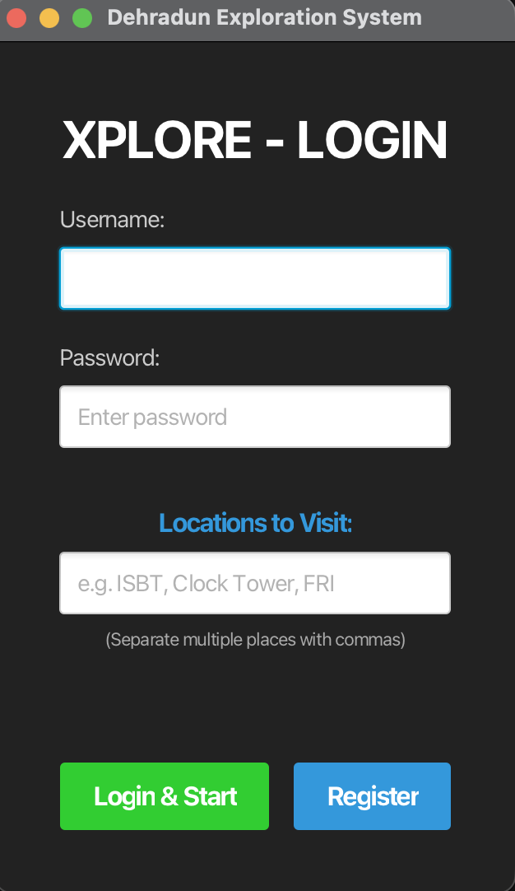

# 🗺️ Xplore — Dehradun Map Exploration System

A JavaFX desktop application that turns real-world exploration of Dehradun into a gamified experience. Unlock zones, complete location-based quests, and lift the fog of war as you explore the city.

   

---

## ✨ Features

- 🔐 **User Authentication** — Register and login with persistent user profiles
- 🌫️ **Fog of War Map** — Real Dehradun map starts covered; zones reveal as you explore
- 📍 **Zone Unlocking** — Unlock real landmarks like Clock Tower, ISBT, Railway Station, and more
- 📋 **Quest System** — Each zone comes with location-based quests and objectives
- 📊 **Progress Tracking** — Visual progress bar tracking your exploration completion
- 🗄️ **SQLite Database** — Lightweight local database for user data and zone state

---

## 🖼️ Screenshots

### Login Screen



### Map View with Fog of War


### Zone Unlock & Quest Panel


---

## 🏙️ Explorable Zones (Dehradun)

|Zone|Type|Quest|
|---|---|---|
|ISBT|🚌 Bus Terminal|ISBT Explorer|
|Railway Station|🚂 Transit Hub|Railway Station Explorer|
|Clock Tower|🕐 Landmark|Clock Tower Explorer|
|Paltan Bazaar|🛒 Market|_(via Clock Tower quest)_|
|+ more zones|...|...|

---

## 📁 Project Structure

```
Xplore1/
├── src/
│   ├── app/
│   │   └── Main.java               # Entry point
│   ├── controller/
│   │   ├── LoginController.java    # Login/register logic
│   │   └── MapController.java      # Map & quest logic
│   ├── database/
│   │   ├── DBConnection.java       # SQLite connection
│   │   ├── UserDAO.java            # User data access
│   │   └── ZoneDAO.java            # Zone data access
│   ├── model/
│   │   ├── User.java
│   │   ├── Zone.java
│   │   └── Quest.java
│   ├── service/
│   └── util/
├── resources/
│   ├── ui/
│   │   ├── Login.fxml
│   │   ├── MainUI.fxml
│   │   └── MapView.fxml
│   ├── map.png
│   └── fog.png
├── javafx-sdk-21.0.2/              # JavaFX runtime (not tracked in git)
├── sqlite-jdbc.jar
├── run.bat                         # Windows launch script
└── run.sh                          # Linux/macOS launch script
```

---

## 🚀 Getting Started

### Prerequisites

- Java 17 or higher
- JavaFX SDK 21 ([Download here](https://gluonhq.com/products/javafx/))

### Setup

**1. Clone the repository:**

```bash
git clone https://github.com/Dhruv-Sharma29/Xplore-Map-Exploration-System.git
cd Xplore-Map-Exploration-System
```

**2. Download JavaFX SDK 21** and place it in the project root as `javafx-sdk-21.0.2/`

**3. Run the app:**

_Windows:_

```cmd
run.bat
```

_Linux / macOS:_

```bash
chmod +x run.sh
./run.sh
```

> The SQLite database (`explore.db`) is auto-created on first launch.

---

## 🛠️ Tech Stack

|Layer|Technology|
|---|---|
|UI|JavaFX 21 + FXML|
|Backend|Java 17|
|Database|SQLite via JDBC|
|Build|Manual classpath (no Maven/Gradle)|

---

## 🎮 How to Play

1. **Register** a new account or login with existing credentials
2. Enter the **locations you want to explore** (e.g. ISBT, Clock Tower, FRI)
3. Watch the **fog lift** on the map as zones get unlocked
4. Complete **quests** tied to each location
5. Track your **progress** toward 100% city exploration

---

## 👨‍💻 Author

[**Dhruv Sharma** ](https://github.com/Dhruv-Sharma29)

[**Arnav Chauhan** ](https://github.com/ArnavChauhan07)

---

## 📄 License

This project is for academic purposes. Feel free to fork and build on it.
